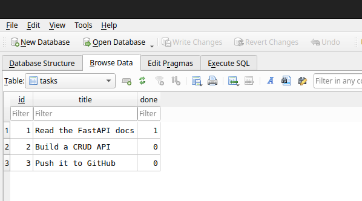

# Exploring `tasks.db` with SQL

Everything below was run against the real database file with the `sqlite3` CLI
(`sqlite3 -header -column tasks.db "<query>"`). DB Browser for SQLite shows the
same table if you prefer clicking to typing.

The table started with the three seeded tasks plus one created through
`POST /tasks`.

## List every task

```console
sqlite> SELECT * FROM tasks;
id  title                  done
--  ---------------------  ----
1   Read the FastAPI docs  1
2   Build a CRUD API       0
3   Push it to GitHub      0
4   Buy milk               0
```

## Show only completed tasks

`done` is stored as `0`/`1` — SQLite has no separate boolean type, so `BOOLEAN`
in the schema is really an integer. Pydantic converts it back to `true`/`false`
on the way out of the API.

```console
sqlite> SELECT * FROM tasks WHERE done = 1;
id  title                  done
--  ---------------------  ----
1   Read the FastAPI docs  1
```

## Count all tasks

```console
sqlite> SELECT COUNT(*) FROM tasks;
COUNT(*)
--------
4
```

## Mark every task as completed

No `WHERE`, so every row is updated — the whole point of the exercise, and a good
reason to be careful with `UPDATE` in a real database.

```console
sqlite> UPDATE tasks SET done = 1;

sqlite> SELECT * FROM tasks;
id  title                  done
--  ---------------------  ----
1   Read the FastAPI docs  1
2   Build a CRUD API       1
3   Push it to GitHub      1
4   Buy milk               1
```

## Delete all completed tasks

Since the previous query completed everything, this empties the table.

```console
sqlite> DELETE FROM tasks WHERE done = 1;

sqlite> SELECT COUNT(*) FROM tasks;
COUNT(*)
--------
0
```

The next server start finds the table empty and seeds the three example tasks
again — that is the "insert only if empty" rule from Stage 0 doing its job.

## The API reflects manual changes immediately

With the server already running, a row inserted by hand in `sqlite3` shows up in
the very next `GET /tasks`. No restart, no cache — the endpoint opens a
connection and reads whatever is on disk right now.

```console
sqlite> INSERT INTO tasks (title, done) VALUES ('Added by hand in sqlite3', 1);
```

```console
API before: [{"id":1,...},{"id":2,...},{"id":3,...}]
API after : [{"id":1,...},{"id":2,...},{"id":3,...},
             {"id":4,"title":"Added by hand in sqlite3","done":true}]
```

## Screenshot


