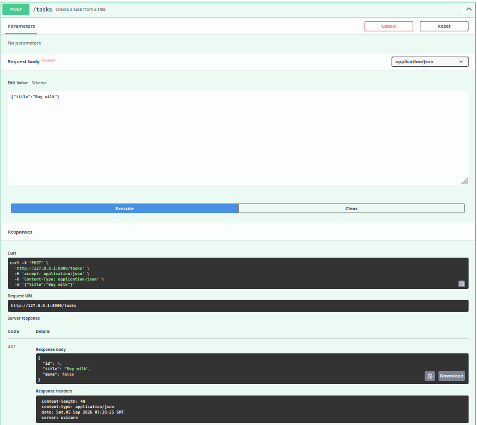
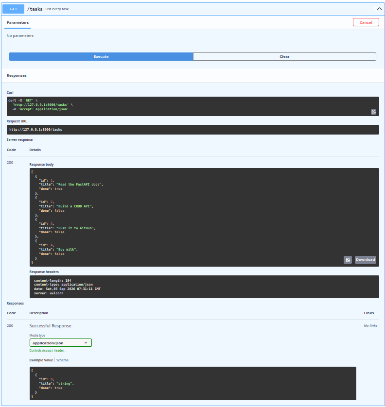
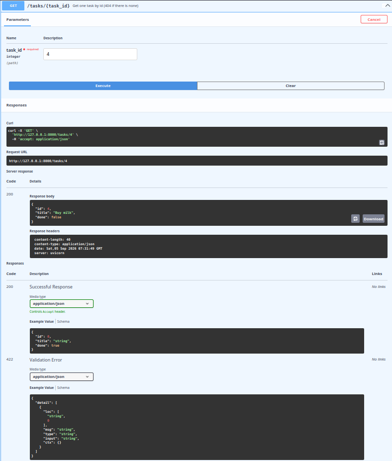
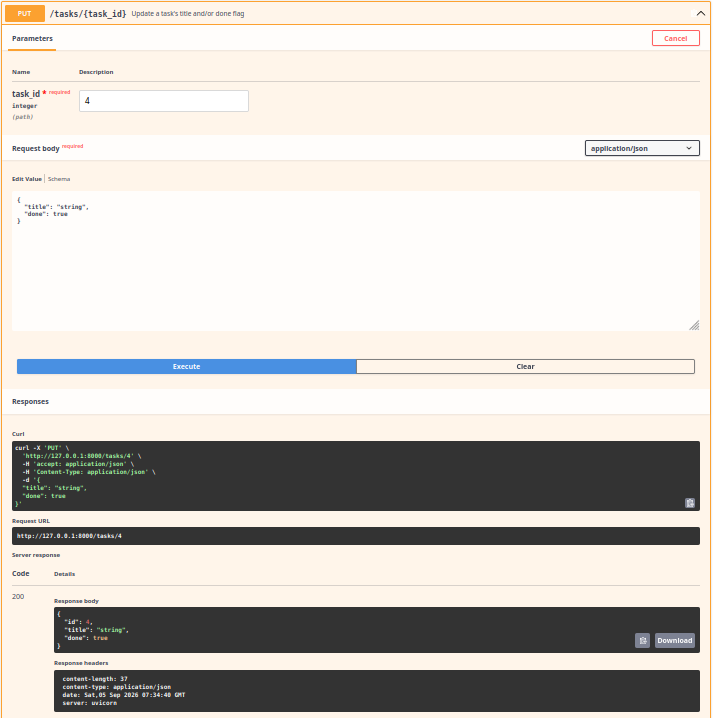
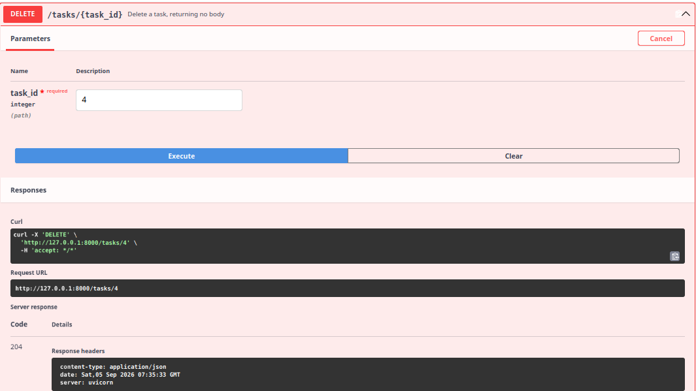

# The full CRUD cycle in Swagger UI

FastAPI builds the OpenAPI spec from the type hints in [main.py](../main.py), so
<http://localhost:8000/docs> needs no setup — every endpoint is listed with its
schema and a **Try it out** button that sends real requests.

Every screenshot below was taken from that page. No curl involved.

**Create** — `POST /tasks` with `{"title": "Buy milk"}` returns **201** and the new task:

**Read all** — `GET /tasks` returns **200** and the list, now four tasks long:

**Read one** — `GET /tasks/4` returns **200** and the single task:

**Update** — `PUT /tasks/4` returns **200** and the task with `done` flipped to true:

**Delete** — `DELETE /tasks/4` returns **204** with an empty body:

## One wrinkle in the generated docs

The lower "Responses" section of `GET /tasks/{task_id}` documents a **422
Validation Error**. That is FastAPI's automatic entry for a path parameter that
is not an integer. This API answers **400** there instead, via the
`RequestValidationError` handler in [main.py](../main.py). Only the generated
documentation says 422; the real response is 400.
